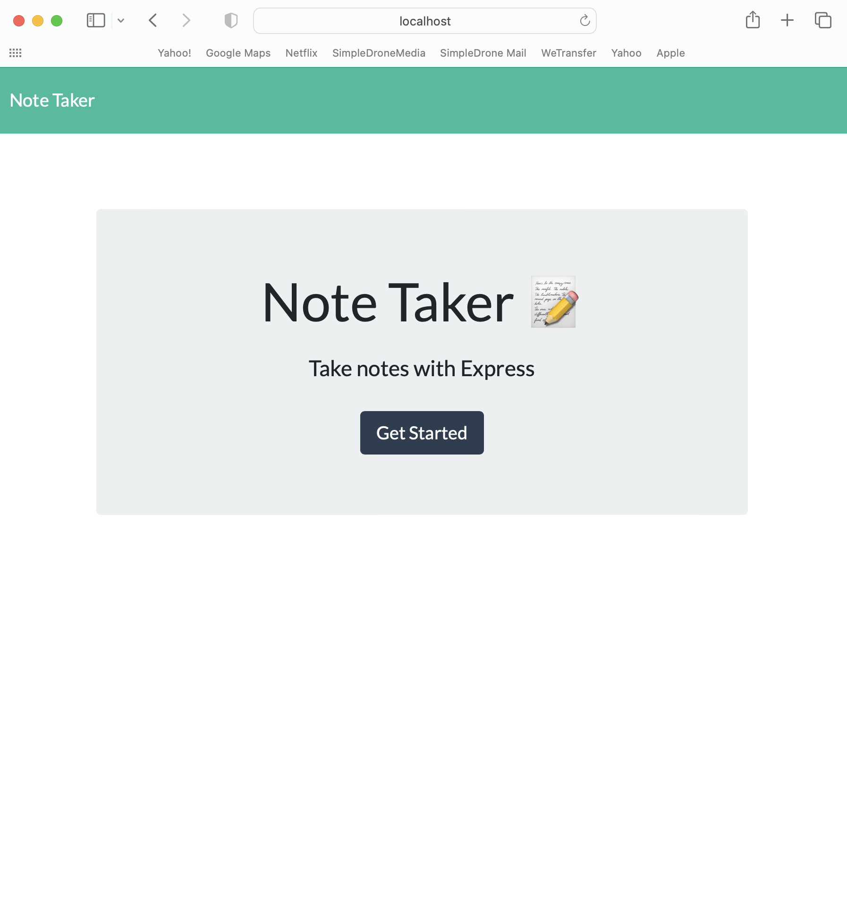
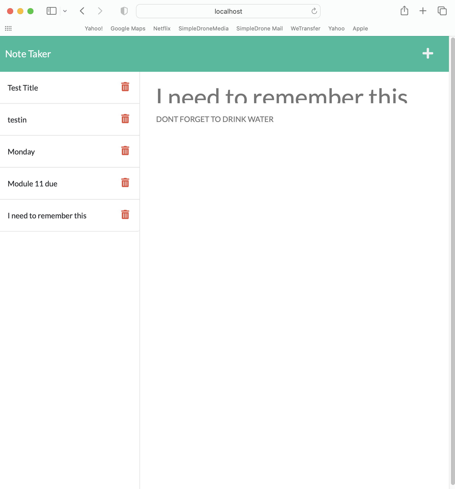

# canaano-Note-Taker

## Deployment on Heroku

https://canaano-note-taker.herokuapp.com/

## GITHUB repo

https://github.com/canaano/Note-Taker

## Screenshots

## Table of Contents

[Description](#description) 
[Usage-Information](#usage) 
[Testing-Instructions](#tests) 

## The Title of the Application

Note Taker

## Description

Note Taker App is a clean and simple application that provides an online way to store notes with a title and body. Starter code was provided for this application so the look is quite generic.

## Usage

Use for an online application to keep notes. Delete functionality coming...
